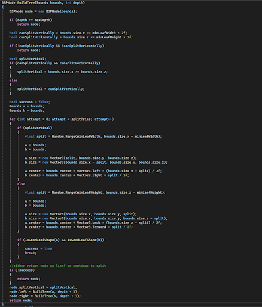
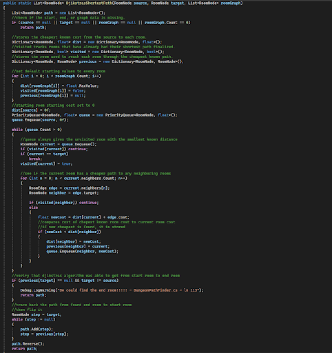
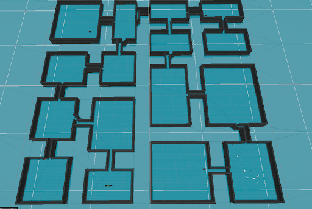
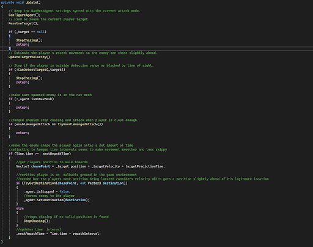
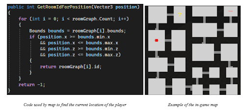
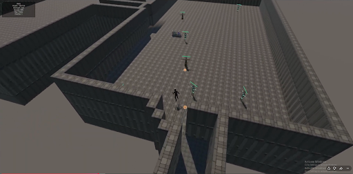
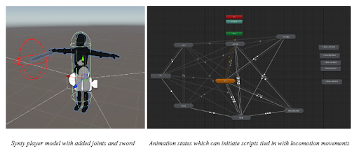
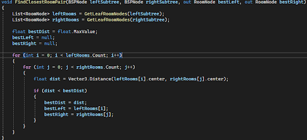

# Synergy

## Play the Game
**Download the latest playable build:** [Synergy Releases](../../releases)
Extract the ZIP, choose your operating system, and run the included installer or executable.
Synergy is a Unity-based roguelike developed as my M.S. Computer Science capstone project.

## Overview

The project focuses on procedural dungeon generation, pathfinding, and algorithm-driven gameplay systems. It combines custom level-generation logic with AI, combat, progression, and Unity-based gameplay systems.

## Features

- Procedural dungeon generation using Binary Space Partitioning
- Genetic Algorithm used for procedural object/room placement
- Dijkstra's Algorithm for pathfinding
- Enemy AI and combat systems
- Player progression and item systems
- Custom Unity UI and gameplay systems

## Technologies

- C#
- Unity
- Object-Oriented Programming
- Data Structures and Algorithms
- Binary Space Partitioning
- Genetic Algorithms
- Dijkstra's Algorithm

## Screenshots
### Binary Space Partitioning Tree

### Dijkstra's Pathfinding

### Procedural Dungeon Generation

### Enemy Chase Logic

### Mini Map

### Random Enemy Spawning

### Rigged Player Model

### Room Determination Logic

